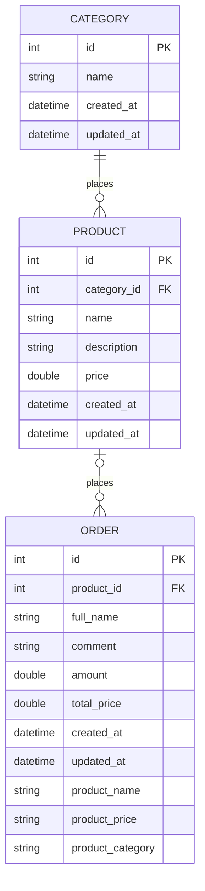

## Описание
Мини-проект, позволяющий создавать и управлять товарами (изменять и удалять).

По созданному товару можно оформить заказ, указав количество товара, для расчета стоимости заказа.

## Стек
Laravel, MySQL, Docker Compose, Blade, Vite

## Модель данных



## Деплой
### Локально
Для локального запуска и разработки выполнить:
1. Сделать файл make-env.sh исполняемым:
```shell
chmod +x make-env.sh
```
2. Сформировать .env файл:
```shell
./make-env.sh local
```
3. Запустить проект:
```shell
docker compose up -d
#or
docker compose up --watch #для разработки
```
Приложение, развернутое локально, доступно по http://localhost:8080/