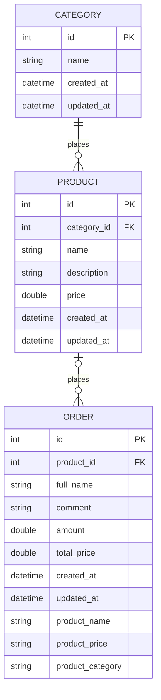

## Описание
Мини-проект, позволяющий создавать и управлять товарами (изменять и удалять).

По созданному товару можно оформить заказ, указав количество товара, для расчета стоимости заказа.

## Стек
Laravel, MySQL, Docker Compose, Blade, Vite

## Docker сервисы
- gateway. Образ nginx. Для приема внешних запросов
- app. Образ php-fpm. Приложение на Laravel для обработки запросов
- db. Образ mysql. База данных приложения

## Модель данных



## Деплой
### Локально
Для локального запуска и разработки выполнить:
1. Сделать файл make-env.sh исполняемым:
```shell
chmod +x make-env.sh
```
2. Сформировать .env файл:
```shell
./make-env.sh local
```
3. Запустить проект:
```shell
docker compose up -d
#or
docker compose up --watch #для разработки
```
Приложение, развернутое локально, доступно по http://localhost:8080/

### Запуск тестов (локально)
Предварительно сделать скрипт исполняемым:
```shell
chmod +x local-test.sh
```

Для запуска тестов использовать комманду:
```shell
./local-test.sh
```
Запуск команды изменит файл .env, перезапустит контейнер app, в котором пройдут тесты, а затем снова перезапуститься и запуститься в локальном режиме --watch
